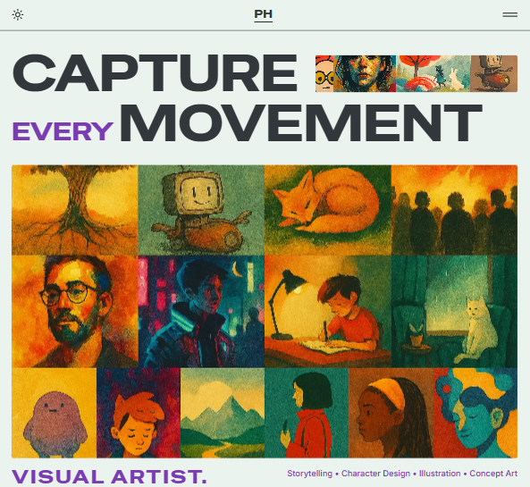

# PH

> Un lienzo digital de creatividad minimalista y dinámico

## Descripción

PH es un portafolio moderno y minimalista de una ilustradora ficticia llamada Priscila Hop.  
Incorpora cambio de tema (claro/oscuro) e idioma (ES/EN).  
Aplica mejores prácticas de SEO y performance: meta tags dinámicos, sitemap automatizado, optimización de imágenes con Sharp, prerendering de rutas críticas y carga diferida de recursos.

## Tabla de Contenidos

- [Demo](#demo)
- [Tecnologías](#tecnologías)
- [Instalación](#instalación)
- [Scripts](#scripts)
- [Uso](#uso)

## Demo

En vivo en Vercel:  
https://ph-portafolio.vercel.app

## Tecnologías

- Astro 5.14.1
- Tailwind CSS 4.1
- Sharp 0.34
- pnpm
- MDX
- Integraciones SEO & Performance: Astro SEO, astro-sitemap, Lighthouse CI

## Instalación

git clone <https://github.com/Fr4nco77/ph-portfolio.git>
cd PH
pnpm install
pnpm run dev

## Scripts

- "dev": "astro dev",
- "build": "astro build",
- "preview": "astro preview",

## Secciones del Sitio

- **Home**  
  Página de inicio con una introducción breve, tagline y acceso rápido a las demás secciones.  
  Incluye un hero con imagen destacada, botones de navegación, proyectos recientes y destacados.

- **About**  
  Sección de presentación de la ilustradora ficticia.  
  Contiene biografía, estilo artístico, enfoque creativo y objetivos.

- **Contact**  
  Página con formulario funcional para contacto directo.
  - Campos: nombre, email, mensaje.
  - Validación básica en frontend.
  - Integración con servicio de envío (ej. Formspree, Netlify Forms, o API propia).

- **Catalog**  
  Galería de ilustraciones organizadas en colecciones.
  - Cada proyecto se gestiona con archivos `.md` en `src/content/projects`.
  - Las imágenes se almacenan en `src/assets/projects/`.
  - Diseño en grid responsivo con filtros o categorías opcionales.

- **Blog**  
  Espacio para artículos y reflexiones de la ilustradora.
  - Contenido en `.mdx` dentro de `src/content/blog`.
  - Temas sugeridos: diseño, productividad, procesos creativos.
  - Soporte para componentes interactivos dentro de los posts.
